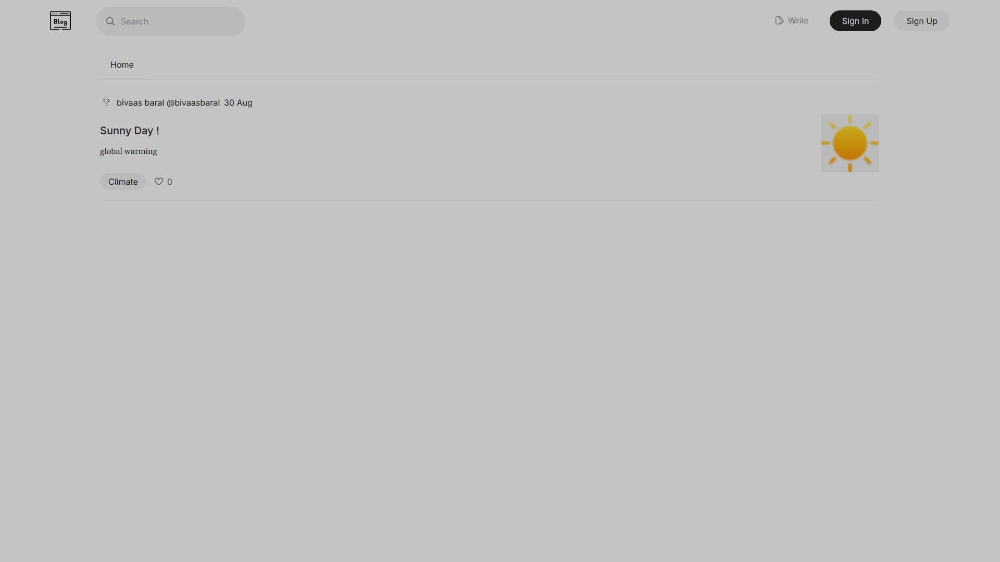
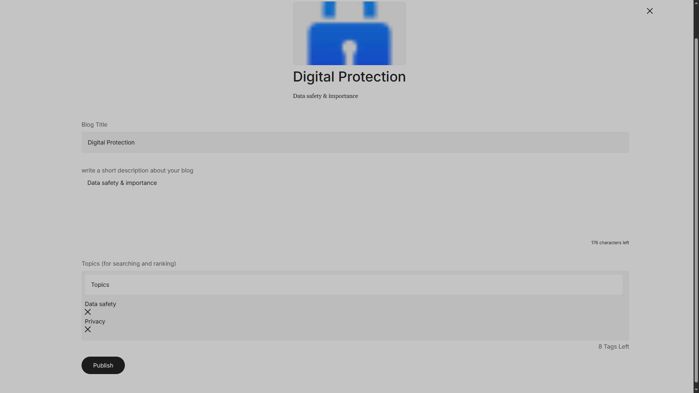

# Bloggo Folio

A site made personally for me to write blogs in near-future. This site is somewhat inspired my medium where we sign in, post in block editor, publish it and then displays in homescreen for everyone to read. If you're thinking how I ended up with this, I even dont know. The two words "blog" and "portfolio" came into my find, I thought of some combinations then got this name. 

I originally thought of building this to write whatever comes into my mind. I also thought of having it as subdomain of my site but I wont be doing it since this project is currently only MVP. I badly underestimated how much time would be required for this project. In the time I imagined for this project to be complete, I could only complete a basic working prototype. Still, I gotta have search, dashboard, edit / delete, comment and other profiles added to this project later on. 

## Features

Firstly, all blogs are public and appears in homepage. For login, manual credentials or google oauth login is available and username is set accordingly. For blog, banner, title, short description, tags and main contents can be written. The tags help in search and ranking later on. since this is mvp project, basic working and flow of blog submission works here. 

*Home page showing all public blogs*


*Interface during publishing a blog*



# Tech-stack

React + vite + tailwindcss 

firebase  

Express, Node.js 

## Dependencies

react-router-dom;
axios;
firebase;
react-hot-toast ;

express;
mongose;
cors;
bycriptjs;
jwt;
dotenv;
nodemon;
editor js;

# Use of AI 

I used AI for error diagnosis, frontend validations, proper implementation of Authentication and Authorization, fix typos and error handling. I used AI only to fix my code and achieve what I was trying to make and also while planning about the project and its basic structure. 

# Extras

The frontend is react and vite with Express. I used bcryptjs for hashing email/password and returns JWT. Google sign in gets firebase token and server verifies it then its just token. Posts are also stored in mongoDB as JSON because I can change how code block looks later without touching any saved post. I have used imgbb to store banner of each blogs. 

I once kept EditorJS instance in react state in editor page when I published, due to the editor isready state getting true the content went lost to it. so, publish click means empty post saved. so, never doing that again and its fixed now. 


# Everything I've used: 

```
Flaticon icon set: https://cdn-uicons.flaticon.com/uicons-regular-rounded/css/uicons-regular-rounded.css
Avatars: https://www.dicebear.com/
Img hosting (banner) :https://api.imgbb.com/
```